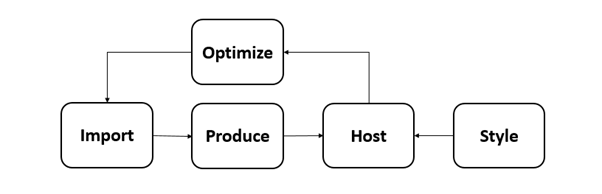
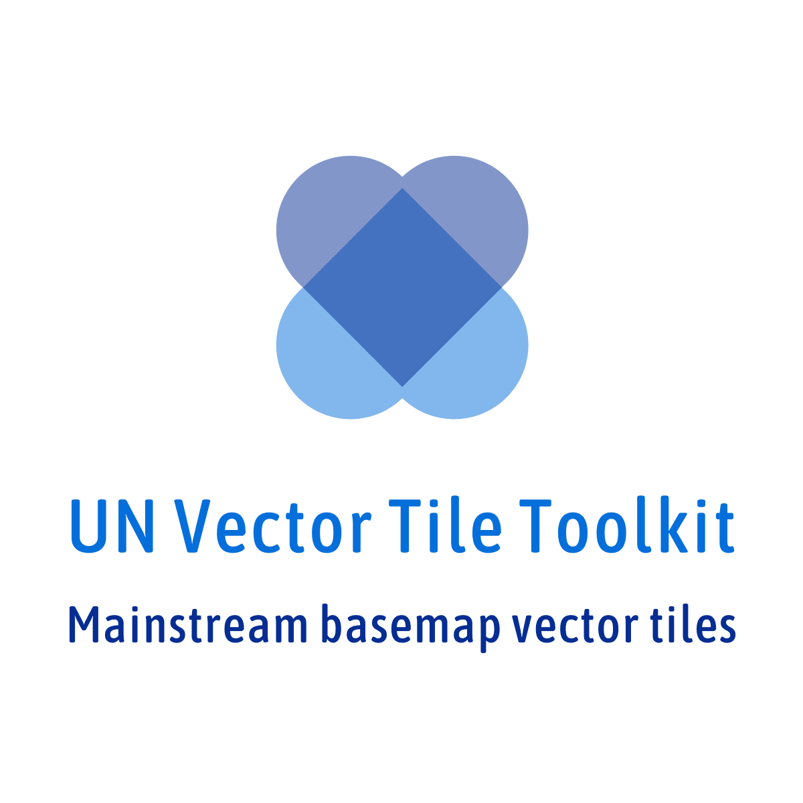

# UN Vector Tile Toolkit

## 1. Objective
The objective of the UN Vector Tile Toolkit is to facilitate the production by public organizations of vector tiles for further use as basemaps. The UN Vector Tile toolkit aims at providing the appropriate environment to enable public organizations to use and produce basemaps in a way that is as user-friendly as the ones provided by the dominant web map platforms. 

## 2. Structure
The figure below represents the structure of the UN Vector Tile Toolkit, which makes maximum use of existing open source software while adding tailor-made scripts developed in the UN and shared openly for the community. 

### 2.1 Import
This function intends to import data from existing data sources and to assign layer names and zoom levels. This has been achieved by the creation of custom open source scripts specific for this function. We design these scripts to keep data-specific settings private from the open source repository. The data sources will include PostGIS, ESRI Shapefile, OSM PBF, [GeoJSON Text Sequence](https://tools.ietf.org/html/rfc8142), and GeoJSON Vector Tiles.

### 2.2 Produce
This function aims at producing vector tile packages in mbtiles format from GeoJSON Text Sequence from the previously mentioned Import function. We use [Tippecanoe](https://github.com/mapbox/tippecanoe) for this step. 

Automatic and continuous update of vector tiles is important. We realized this by producing vector tile packages by modules whose extent are exactly the same as those of the tiles at zoom level 6.

### 2.3 Host
The goal of this function is to host modular vector tile packages. Node.js scripts were created to achieve this in a simple and scalable manner. Some script includes a feature to provide vector tiles by mimicking the behavior of an ArcGIS Server. This function is small but essential to ensure proper performance and interoperability. 

### 2.4 Style
[Maputnik](https://github.com/maputnik/editor) is used at this stage in order to properly style the hosted vector tiles according to the appropriate desired look and feel.

### 2.5 Optimize
This function tries to enhance the optimization of the size of individual vector tiles to ensure high-performance vector tile service. This tool measures and visualizes the size of individual vector tiles or the whole vector tile package, to assist the proper design of the vector tile schema.

It is too easy to create oversized vector tiles. Oversized vector tiles make the whole application slow that is why new scripts were developed to calculate and visualize a matrix to show the distribution of the size of individual vector tiles in a vector tile package with the intention to act at the data level on those that yield larger sizes. A JavaScript program was also created to visualize the size of individual vector tiles on a web map. 

## 3. Achievement
A global vector tile prototype has already been developed for internal use in the United Nations. The transfer size of individual vector tiles has been optimized to achieve under 128KB. Also, the prototype is interoperable with a framework that works with ArcGIS Server Vector Tile Service. 

The plan is to ensure that the prototype can be updated automatically and continuously, within one-day delay from the database update. As of now, it can be confirmed that the global vector tile dataset can be produced well within a week.

## 4. Recent progress
The OSGeo.JP Workshop for UN Vector Tile Toolkit was held on 2 December 2018 in Moratuwa, Sri Lanka. The workshop provided a hands-on experience for producing and hosting optimized vector tiles. [The hands-on material](https://speakerdeck.com/hfu/the-osgeojp-workshop-for-the-un-vector-tile-toolkit) is available to the community in an open manner. 

Version 1 of the UN Vector Tile Toolkit was released in a [keynote speech](https://speakerdeck.com/hfu/collaboration-of-geospatial-information-communities-through-the-un-open-gis-initiative) of the FOSS4G Asia 2018.

The Geospatial Information Authority of Japan is also using the UN Vector Tile Toolkit to prototype their vector tile production. 

